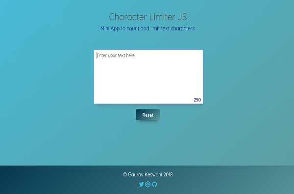

# Character-Limiter-JS-Master
Mini App to count and limit text characters .
<h1 align="center">Character Limiter JS</h1> 

Mini app to count and limit text characters made with Vanilla JavaScript. 
Live preview: <a href="http://www.gauravkeswani.com/character-limiter-js-master/index.html">Character Limiter JS</a> 

