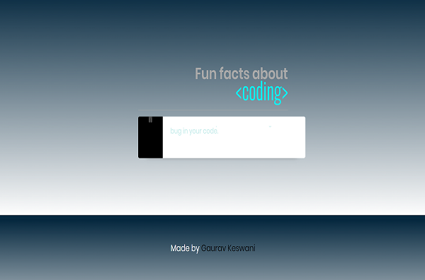

# Fun-Facts-About-Coding-Master
Little app to display coding related facts .
<h1 align="center">Fun facts about coding</h1> 

Mini app to display coding related facts using CSS animations and vanilla JS. 
Live preview: <a href="https://github.com/Gaurav3170/Fun-Facts-About-Coding-Master">Fun facts about coding</a> 

